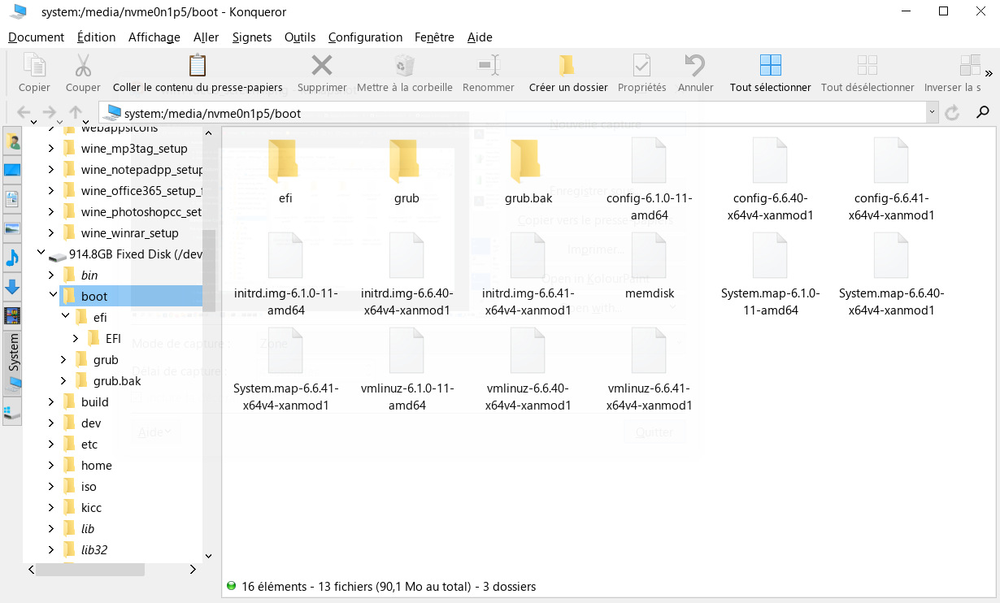
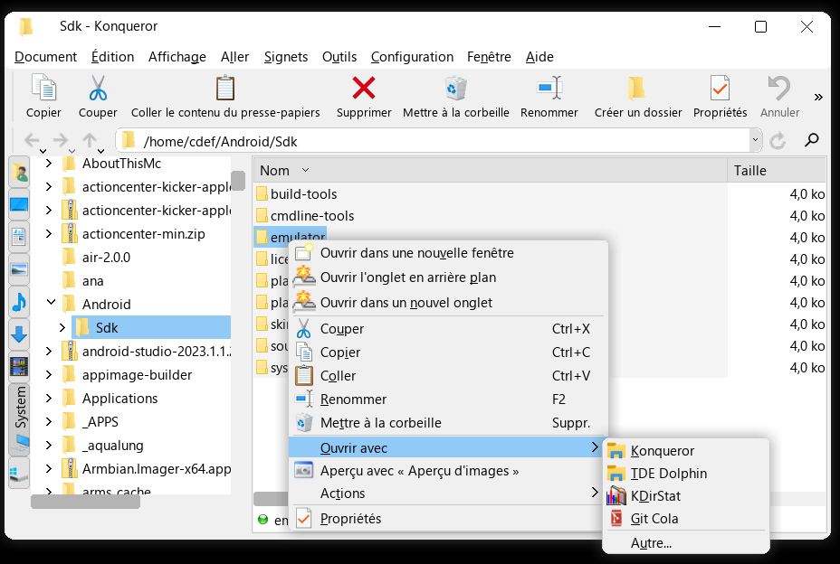
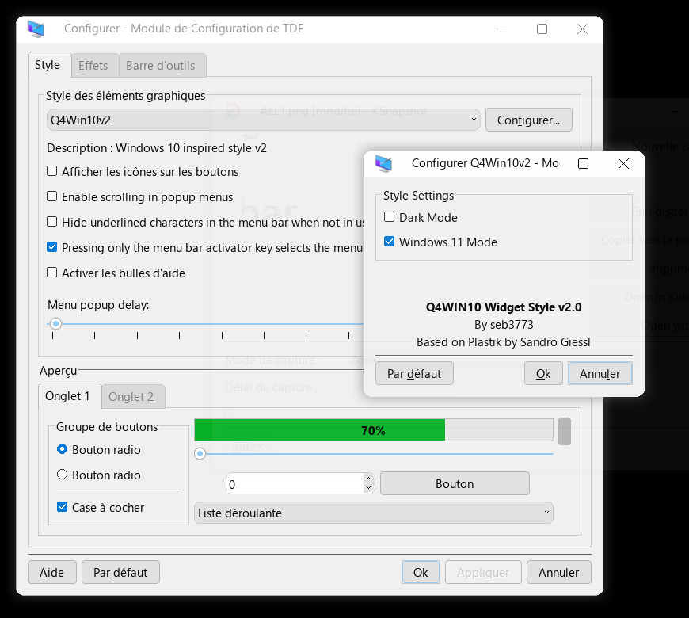

# Q4WIN10 Widget Style for Trinity Desktop (TDE)

[](https://github.com/seb3773/tdestyle-Q4WIN10/releases)
[](https://www.gnu.org/licenses/old-licenses/gpl-2.0.html)
[](https://www.trinitydesktop.org/)
[](https://seb3773.github.io/tdestyle-Q4WIN10/)

A lightweight, modern Windows 10 & Windows 11 inspired widget style plugin for the Trinity Desktop Environment (TDE / TQt3), based on Plastik and designed to perfectly complement the [Q4WIN10 Window Decoration](https://github.com/seb3773/tde-win-deco-Q4WIN10).

Compatible across **all Trinity Desktop R14.1.x versions** (R14.1.0 to R14.1.6+) as a single standalone universal binary.

---

## ✨ Features & Highlights

* **Windows 10 Mode (Default)**:
  * Crisp flat design with sharp borders and clean solid color fills.
  * Vector checkmarks and radio dots adapting seamlessly to light and dark color schemes.
* **Windows 11 Mode**:
  * Curved tabs (6px radius) with surgical clipping.
  * Rounded controls (comboboxes, text edits, spin widgets, popup menus, scrollbar sliders).
  * Rounded checkboxes and custom radio indicators.
* **Dark Mode**:
  * Native dark mode support for dark desktop themes.
* **Menubar Integration**:
  * Seamless X11 Atom integration (`_Q4WIN10_MENUBAR_HEIGHT`) matching the window decoration.
* **High-Performance Engine**:
  * Zero dynamic heap cache overhead (pure flat vector drawing).
  * Fast bitwise arithmetic (`div255`) for alpha blending.
  * Zero runtime RTTI traversals in paint loops (`::tqt_cast` & direct device checks).
  * Compiled with aggressive optimizations (`-O2`, `-flto`, `-fno-exceptions`, `-fvisibility=hidden`):
    * **Style Plugin (`q4win10.so`)**: **~136 KB**
    * **Config Plugin (`tdestyle_q4win10_config.so`)**: **~33 KB**
    * **Debian Package (`.deb`)**: **~43 KB**
    * **Q4OS Installer (`.qsi`)**: **~104 KB**

---

## 🚀 Easy Installation

### Method 1: Official APT Repository (Recommended)
Add the official repository to receive automatic updates alongside your system packages:

```bash
echo "deb [trusted=yes] https://seb3773.github.io/tdestyle-Q4WIN10/ stable main" | sudo tee /etc/apt/sources.list.d/tde-win-style-q4win10.list
sudo apt update
sudo apt install tde-win-style-q4win10
```

### Method 2: Q4OS Graphical Installer (`.qsi`)
Download or run the standalone `.qsi` installer:
```bash
./setup_tde-win-style-q4win10_2.0.3.qsi
```

### Method 3: Debian Package (`.deb`)
```bash
sudo dpkg -i tde-win-style-q4win10_2.0.3_amd64.deb
```

---

## 🖼️ Screenshots







---

## 🛠️ Building from Source

### Prerequisites
Ensure standard TDE and TQt development packages are installed:
```bash
sudo apt install tde-cmake-trinity tdelibs14-trinity-dev libtqt3-mt-dev tqt3-dev-tools
```

### Build Packages (`.deb` and `.qsi`)
```bash
# Build standalone Debian package:
./create_deb.sh

# Or build both .deb and Q4OS .qsi installer:
./create_qsi.sh
```

### Direct Standalone Makefile Build
```bash
make clean && make -j$(nproc)
sudo make install
```

---

## 📄 License & Credits

* **Author**: Seb3773 (<https://github.com/seb3773>)
* **Based on**: Plastik widget style by Sandro Giessl
* **License**: GNU Lesser General Public License v2 (LGPL-2.0+) / GPL-2.0+
